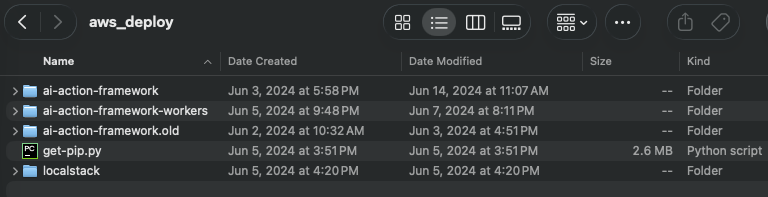

# AI Action Framework

An LLM-powered orchestration layer that dynamically routes user requests to registered API workers using natural language understanding. Built with AWS CDK, Lambda, DynamoDB, and API Gateway.

## The Story

In **June 2024**, I was thinking about a problem I kept seeing in AI integrations: tools were hardcoded into every system. Add a new API, rewrite the orchestrator. Change an endpoint, redeploy everything. It felt brittle. So I built a proof-of-concept around a different idea: **what if the tools could register themselves, and the LLM could figure out the rest?**

The result was this framework. Independent services ("workers") register themselves in a DynamoDB table, describing what they do, what inputs they need, what outputs they produce, and where to reach them. When a user makes a request, the orchestrator scans the registry, hands all the worker descriptions to an LLM, and lets it reason about which tools to call, in what order, and how to combine the results. Workers can be added or removed without touching the orchestrator. The LLM adapts automatically.

I built four example workers to prove it out: one that fetches weather data, one that queries a project database, one that searches the web via Bing and summarizes results with GPT-4o, and one that routes queries to other LLMs. The orchestration handler runs a conversation loop where the LLM can chain multiple tool calls, ask the user for clarification, and synthesize a final answer.

**Five months later, in November 2024, Anthropic announced the Model Context Protocol (MCP).** When I read the spec, I recognized the pattern immediately. Dynamic tool discovery. Self-describing schemas. An LLM reasoning about which tools to call. Decoupled servers that can be added independently. The core ideas were the same.

I'm not claiming I invented MCP. MCP is a protocol specification backed by Anthropic, now governed by the Linux Foundation's Agentic AI Foundation alongside Google, Microsoft, OpenAI, and AWS. What I built is an opinionated serverless implementation. They're solving at different layers. But I did independently arrive at the same architectural pattern, and I had working code before the protocol existed. I think that's worth something.

When I built this in 2024, I thought it was just a useful side project, a pattern that solved a problem I kept seeing. I didn't think to share it. It sat on my machine. Then MCP launched, the industry converged on the same ideas, and I realized the instinct that led me to build this was pointing at something real. I'm sharing it now because I'm thinking bigger. I want to build in public, contribute to the conversations happening around agentic AI, and connect with people working on these problems.

*Local filesystem timestamps from the original project, showing creation dates in June 2024:*



### Where the ideas overlap

| Concept | AI Action Framework (June 2024) | MCP (November 2024) |
|---|---|---|
| **Tool Discovery** | Workers register in DynamoDB with descriptions, input/output schemas, and endpoint paths. The orchestrator discovers them at request time. | Servers expose tools via `tools/list`. Clients discover tools at connection time. |
| **Self-Describing Schemas** | Each worker endpoint declares `description`, `input`, and `output` in a format the LLM can reason about. | Tools declare `name`, `description`, and `inputSchema` (JSON Schema). |
| **Runtime Routing** | The LLM receives all worker descriptions and decides which to call based on the user's request. | The LLM receives tool definitions and decides which to call based on user input. |
| **Multi-Step Orchestration** | Conversational loops: chain worker calls, ask for clarification, synthesize results. | Multi-turn tool use with sequential tool calls. |
| **Decoupled Architecture** | Workers are independently deployed Lambdas. New capability = new worker + register. No orchestrator changes. | Servers are independent processes. New capability = new server. No client changes. |

### What's still interesting in a post-MCP world

Two design choices I made that I think hold up:

1. **Dynamic registry over static configuration.** MCP requires clients to be pre-configured with server connection details. (The MCP team is working on this: Server Cards via `.well-known/mcp` and an official registry launched in September 2025, but it's not in the core protocol yet.) My approach was more like a service mesh: workers announce themselves, the orchestrator discovers them on every request. Zero-config tool discovery.

2. **The agentic conversation loop as a first-class design concern.** The orchestrator implements a structured reasoning loop with three action types: `api_call`, `user_input`, and `final_response`. The LLM picks one at each step. This gives it the ability to chain tools, ask clarifying questions, and decide when it has enough information to respond. MCP only recently started addressing server-side agentic patterns (the November 2025 spec added "Sampling with Tools"), and it's still primarily a transport protocol, not an orchestration framework.

### What this is (and isn't)

This is a **proof-of-concept**. The code has rough edges: conversation state lives in Lambda memory (won't survive cold starts), there's no recursion depth limit on the orchestration loop, and error handling is minimal. I built it to validate the pattern, not to ship to production. If I were rebuilding today, I'd use MCP as the protocol layer and keep the dynamic registry and agentic loop patterns on top.

---

## The Next Question: What About Security?

After building the orchestration layer, I started thinking about a harder problem: **what happens when you deploy this in an enterprise and the LLM has access to sensitive data?**

Consider the scenario: an agent queries a customer database (now PII is in the LLM's context), then the LLM decides it needs to call a web search tool to answer the user's question. That web search call could carry sensitive data in its payload. Nobody in the current ecosystem has a great answer for this.

I looked at what exists:
- **[MCP](https://modelcontextprotocol.io/specification/2025-11-25)** handles authentication (OAuth 2.1 as of the November 2025 spec) and has tool annotations like `readOnlyHint` and `destructiveHint`, but those are explicitly "untrusted hints," not enforceable security controls. There's no mechanism to track what's in the LLM's context or gate tool calls based on it.
- **Cloud platforms** ([AWS Bedrock Guardrails](https://docs.aws.amazon.com/bedrock/latest/userguide/guardrails.html), [Azure AI Foundry](https://azure.microsoft.com/en-us/products/ai-foundry), [Google Vertex AI](https://cloud.google.com/vertex-ai)) have guardrails for content filtering and PII detection on inputs/outputs, plus IAM-based tool authorization. But they authorize based on who the user is and what tool they're calling, not based on what sensitive data is currently in the agent's memory.
- **Security products** ([Lakera](https://www.lakera.ai/), [NVIDIA NeMo Guardrails](https://github.com/NVIDIA/NeMo-Guardrails), [Protect AI's LLM Guard](https://github.com/protectai/llm-guard), [Lasso MCP Gateway](https://github.com/lasso-security/mcp-gateway)) focus on prompt injection, output filtering, and DLP scanning. They inspect content. They don't track accumulated sensitivity state across the session.
- **[The AARM paper](https://arxiv.org/abs/2602.09433)** (February 2026) proposes accumulating session context for policy evaluation, which is the right direction, but stays at the specification level.

The gap I kept coming back to: **nobody is tracking what types of sensitive data have entered the LLM's context window and using that to dynamically gate what the agent can do next.**

So I designed a concept I'm calling **Memory Fingerprinting**. The full write-up is at [docs/MEMORY_FINGERPRINT.md](docs/MEMORY_FINGERPRINT.md).

### The idea

Instead of scanning every payload for sensitive data in real-time (expensive, slow, and still doesn't solve the accumulation problem), introduce a lightweight metadata cache that tracks sensitivity state per session:

1. An agent calls a tool and gets data back.
2. The engine classifies the sensitivity of that response (PII? financial? confidential?).
3. A **fingerprint** is registered: just metadata tags with a TTL, not the data itself. Something like: `{tags: ["pii", "financial"], data_class: "confidential", ttl: 1200s}`.
4. On every subsequent tool call, the policy engine checks accumulated fingerprints. If PII is tagged and the next tool is an outbound web call, the policy can block it, require scrubbing, or flag it for human review.
5. Fingerprints expire with TTLs, so sensitivity state decays naturally as context rotates.

The LLM still gets the raw data it needs. The system around it just knows what sensitivity state has accumulated and enforces boundaries accordingly.

### It plugs into what already exists

Memory fingerprinting is not a platform or a framework. It's a thin layer (a cache and two hooks) that works with off-the-shelf tools:

- **Policy engine**: [Cerbos](https://www.cerbos.dev/) or [AWS Cedar](https://www.cedarpolicy.com/), extended with a condition that queries the fingerprint cache
- **PII detection**: [LLM Guard](https://github.com/protectai/llm-guard) or [Lakera](https://www.lakera.ai/) for classifying tool responses
- **Payload scrubbing**: [NeMo Guardrails](https://github.com/NVIDIA/NeMo-Guardrails), [Lakera](https://www.lakera.ai/), or [LLM Guard](https://github.com/protectai/llm-guard) for redacting outbound data when policy requires it
- **Content moderation**: [NeMo Guardrails](https://github.com/NVIDIA/NeMo-Guardrails), [Azure Content Safety](https://azure.microsoft.com/en-us/products/ai-services/ai-content-safety), [Bedrock Guardrails](https://docs.aws.amazon.com/bedrock/latest/userguide/guardrails.html) for gating final output

The fingerprint cache itself is Redis or DynamoDB with TTL support. A few hundred lines of code. You add two steps to your existing agent loop (check fingerprints before a tool call, register a fingerprint after) and connect a policy engine. That's it.

### Does this exist already?

As far as I can tell, no. I surveyed the landscape: [Lasso MCP Gateway](https://github.com/lasso-security/mcp-gateway), [TrustLogix TrustAI](https://trustlogix.io/), [Securiti Agent Commander](https://securiti.ai/), [Open Edison](https://github.com/open-edison), the [AARM paper](https://arxiv.org/abs/2602.09433), [Cerbos](https://www.cerbos.dev/), [Permit.io](https://www.permit.io/), every cloud platform's guardrail system. They all solve adjacent problems (DLP, content moderation, static authorization, data lineage). None implement per-session sensitivity tagging that accumulates as tools return data and dynamically gates subsequent tool calls.

If I'm wrong and someone has built this, I'd genuinely like to know.

### What's next

I'm planning to build a reference implementation: a lightweight Python library that wraps any agentic loop with fingerprint tracking and policy evaluation. I also want to write this up as a formal input to [NIST's AI Agent Standards Initiative](https://www.nist.gov/caisi/ai-agent-standards-initiative) (their RFI on Agent Security is open through March 2026) and engage with the MCP community about extending tool annotations with sensitivity metadata.

The full design document (how fingerprinting integrates with the orchestration loop, tool sensitivity declarations, policy rules, the off-the-shelf integration map, and implementation notes) is at [docs/MEMORY_FINGERPRINT.md](docs/MEMORY_FINGERPRINT.md).

---

## Architecture

```
                    +-------------------+
                    |   API Gateway     |
                    |  /execute (POST)  |
                    |  /register (POST) |
                    |  /workers (GET)   |
                    +--------+----------+
                             |
              +--------------+--------------+
              |                             |
    +---------v----------+       +----------v---------+
    | AI Action Handler  |       | Registry Handler   |
    | Lambda             |       | Lambda             |
    |                    |       |                    |
    | 1. Get workers     |       | - Register worker  |
    |    from DynamoDB   |       | - List workers     |
    | 2. Build LLM prompt|       +--------------------+
    |    with worker     |
    |    descriptions    |                +----------+
    | 3. LLM decides     |                | DynamoDB |
    |    which worker    +--------------->+ Workers  |
    |    to call         |                | Table    |
    | 4. Call worker API |                +----------+
    | 5. Evaluate result |
    | 6. Loop or respond |
    +---------+----------+
              |
              |  Calls registered worker endpoints
              |
    +---------v-------------------------------------------+
    |                Worker API Gateway                    |
    |  /weather (POST)  /project (POST)  /web/search (POST)|
    +---+---------------+---------------+-----------------+
        |               |               |
   +----v----+    +-----v-----+   +-----v-----+
   | Weather |    | Project   |   | Web       |
   | Worker  |    | Worker    |   | Worker    |
   | Lambda  |    | Lambda    |   | Lambda    |
   +---------+    +-----------+   +-----------+
```

## Project Structure

```
public_repo/
|-- ai-action-framework/           # Core orchestrator (CDK stack)
|   |-- bin/                        # CDK app entry point
|   |-- lib/                        # CDK stack definition
|   |-- lambda/
|   |   |-- aiActionHandler.ts      # LLM orchestration logic
|   |   |-- registryHandler.ts      # Worker registration CRUD
|   |   +-- index.ts                # Lambda exports
|   |-- lambda-layer/               # Shared dependencies
|   |-- .env.example                # Environment variable template
|   |-- .gitlab-ci.yml              # CI/CD pipeline
|   |-- cdk.json                    # CDK configuration
|   |-- package.json
|   +-- tsconfig.json
|
|-- ai-action-framework-workers/    # Example workers (separate CDK stack)
|   |-- bin/                        # CDK app entry point
|   |-- lib/
|   |   |-- deploy_workers-stack.ts # Worker infrastructure
|   |   +-- generateWorkerRegistration.js  # Worker registration script
|   |-- lambda/
|   |   |-- worker.ts               # Base Worker class
|   |   +-- workers/
|   |       |-- weatherWorker.ts    # Weather API worker
|   |       |-- projectWorker.ts    # Project data worker
|   |       |-- llmWorker.ts        # LLM passthrough worker
|   |       +-- webWorker.ts        # Bing search + summarization worker
|   |-- lambda-layer/
|   |-- test/
|   |-- .env.example
|   |-- .gitlab-ci.yml
|   |-- cdk.json
|   |-- package.json
|   +-- tsconfig.json
|
|-- docs/
|   +-- MEMORY_FINGERPRINT.md       # Memory Fingerprinting design concept
|
+-- README.md
```

## How It Works

1. **Workers register** themselves by POSTing their description, key, endpoint schemas, and API paths to `/register`. This stores them in DynamoDB.

2. **A user sends a natural language request** to `/execute` (e.g., "What's the weather in Phoenix and who manages projects there?").

3. **The AI Action Handler**:
   - Scans DynamoDB for all registered workers
   - Constructs a prompt containing all worker descriptions and their endpoint schemas
   - Sends the user's request + worker context to GPT-4
   - GPT-4 returns a structured JSON action (`api_call`, `user_input`, or `final_response`)

4. **The orchestration loop**:
   - If `api_call`: calls the specified worker endpoint, feeds the result back to GPT-4
   - If `user_input`: returns a clarifying question to the user
   - If `final_response`: returns the synthesized answer
   - The loop continues until GPT-4 has enough information to respond

## Deployment

### Prerequisites

- Node.js 18+
- AWS CLI configured with appropriate credentials
- AWS CDK CLI (`npm install -g aws-cdk`)

### 1. Deploy the Core Framework

```bash
cd ai-action-framework

# Copy and configure environment variables
cp .env.example .env
# Edit .env with your actual API keys and AWS account details

# Install dependencies
npm install
cd lambda-layer/nodejs && npm install && cd ../..

# Build
npm run build

# Bootstrap CDK (first time only)
cdk bootstrap

# Deploy
cdk deploy
```

### 2. Deploy the Workers

```bash
cd ai-action-framework-workers

# Copy and configure environment variables
cp .env.example .env
# Edit .env with your actual API keys

# Install dependencies
npm install
cd lambda-layer/nodejs && npm install && cd ../..

# Build
npm run build

# Deploy
cdk deploy
```

### 3. Register Workers

After both stacks are deployed, update the API Gateway endpoint URLs in `generateWorkerRegistration.js` and run it to register the workers with the orchestrator:

```bash
node lib/generateWorkerRegistration.js
```

### Environment Variables

**ai-action-framework/.env:**
| Variable | Description |
|---|---|
| `OPENAI_API_KEY` | OpenAI API key |
| `OPENAI_ORGANIZATION` | OpenAI organization ID |
| `OPENAI_PROJECT` | OpenAI project ID |
| `GPT_ENDPOINT` | OpenAI chat completions endpoint |
| `WEATHER_API_KEY` | WeatherAPI.com API key |
| `CDK_DEFAULT_ACCOUNT` | AWS account ID |
| `CDK_DEFAULT_REGION` | AWS region (e.g., us-east-1) |

**ai-action-framework-workers/.env:**
| Variable | Description |
|---|---|
| `OPENAI_API_KEY` | OpenAI API key |
| `WEATHER_API_KEY` | WeatherAPI.com API key |
| `BING_API_KEY` | Bing Search API key |
| `WORKERS_API_URL` | Base URL of the deployed workers API Gateway |

## Example Workers

| Worker | Description |
|---|---|
| **WeatherWorker** | Fetches current weather and forecasts from WeatherAPI.com |
| **ProjectWorker** | Queries a sample project database (demonstrates internal data source integration) |
| **LLMWorker** | Routes queries to other LLMs (GPT-4o, with stubs for Claude and RAG models) |
| **WebWorker** | Searches the web via Bing API and summarizes results with GPT-4o |

## Creating a New Worker

1. Create a new file in `lambda/workers/` extending the `Worker` base class
2. Define the worker's description, key, and endpoint schemas
3. Implement the `execute` method
4. Add the Lambda function and API Gateway route in `deploy_workers-stack.ts`
5. Deploy and register the worker

## Tech Stack

- **Infrastructure**: AWS CDK (TypeScript)
- **Compute**: AWS Lambda (Node.js 18)
- **API**: AWS API Gateway
- **Storage**: AWS DynamoDB
- **AI**: OpenAI GPT-4 (orchestrator), with extensible worker support for any LLM
- **CI/CD**: GitLab CI/CD

## License

Code: [Apache 2.0](LICENSE)
Design documents (docs/): [CC BY 4.0](https://creativecommons.org/licenses/by/4.0/)

Copyright 2024-2026 [Sean Hussey](https://www.linkedin.com/in/seanphussey/). Free to use, adapt, and build on. Just give credit.
